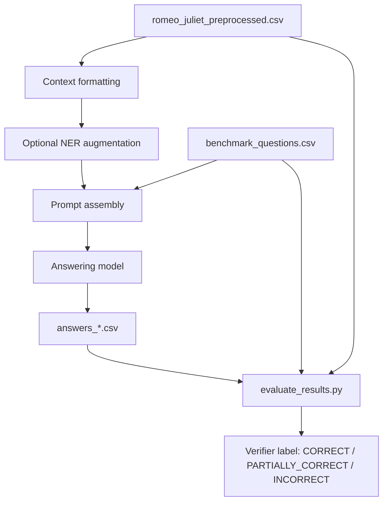
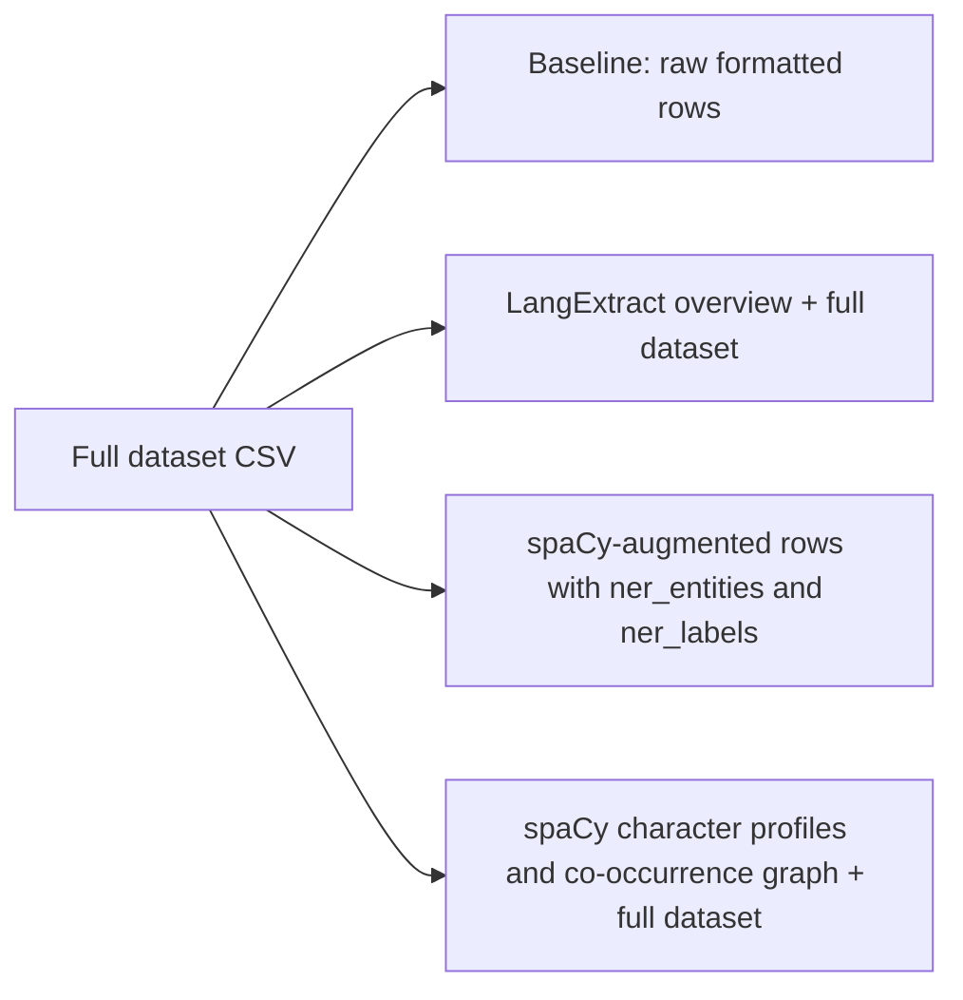

# HW3 Report: Entity-Augmented Long-Context Question Answering on *Romeo and Juliet*

## Abstract

This report studies whether named-entity-aware preprocessing improves long-context question answering over a literary dataset derived from Shakespeare's *Romeo and Juliet*. The benchmark uses a preprocessed 1,068-row CSV representation of the play and a 60-question forensics-style evaluation set with gold answers and row-level evidence mappings. Each model is asked every question against the full dataset, and the resulting answers are scored by a verifier model using the gold answer, analyst observations, and reconstructed evidence rows. Four context conditions are compared: a raw no-NER baseline, a `langextract` summary prepended to the full dataset, a spaCy-augmented CSV with row-level entity columns, and a spaCy-derived character relationship graph prepended to the full dataset.

The results show that entity augmentation can help, but only when the added structure is compact and semantically organized. Across the successful runs, `langextract` is the strongest method. Excluding the failed `llama-1b` NER runs, it improves mean strict accuracy from 30.6% to 36.7% and mean lenient accuracy from 65.6% to 68.1%. The `spacy_graph` condition is lighter and sometimes competitive, but overall it remains close to the raw baseline. By contrast, the plain spaCy row-augmentation strategy is generally counterproductive: it expands the prompt substantially, injects noisy local annotations, and reduces average accuracy. The experiments therefore support a narrow conclusion rather than a broad one. NER-like structure can improve narrative QA in long prompts, but the representation matters as much as the extraction itself.

## 1. Introduction

Long-context question answering over literary corpora is difficult for small and mid-sized language models because the task combines several burdens at once. The model must retain a large amount of textual context, identify which portions matter for a given question, link events across scenes, and reconstruct character relationships without drifting into unsupported inference. A Shakespeare play is an especially harsh version of this setting. Dialogue is dense, names appear in multiple forms, stage directions encode important state changes, and the language itself can confuse off-the-shelf named entity systems.

The central question in this homework is whether explicit entity-aware preprocessing can reduce that burden. The underlying idea is straightforward: if the model receives a structured overview of characters, events, or relationships before it reads the full dataset, perhaps it can navigate the long prompt more efficiently and answer more accurately. That hypothesis is plausible, especially for questions about identity, kinship, scene participation, and causal chains. At the same time, extra structure is not free. Any preprocessing method that adds too much noise, duplicates information, or consumes too much context window may make the task harder rather than easier.

The repository already contains the full benchmark code, the saved answer files, and the evaluation outputs. This report is based on those artifacts. Its goal is not only to summarize scores, but also to explain what each method actually does in code, how the benchmark is constructed, why certain methods help more than others, and where the observed failures come from.

## 2. Materials and Experimental Setting

The source corpus used for answering is `hw3/data/romeo_juliet_preprocessed.csv`. This file contains 1,068 rows derived from the dialogue of *Romeo and Juliet* after preprocessing and merging consecutive lines by the same speaker within a scene. The benchmark consumes the CSV as a textual table rather than as a structured retrieval index. In the default no-NER condition, the answering model sees the entire dataset rendered row by row in the format `line_number | act | scene | character | dialogue`. The practical consequence is important: the system does not first retrieve a small relevant subset for each question. It presents the full play every time.

The question set is stored in `hw3/data/benchmark_questions.csv`. It contains 60 forensics-style questions, each paired with a gold answer, analyst observations, and a list of `csv_row_indices` that identify the relevant evidence rows in the source dataset. The questions are labeled by difficulty, with 11 easy, 31 medium, and 18 hard items. Because those row indices are preserved, the evaluation pipeline can reconstruct supporting evidence after generation and use it during answer scoring.

The models evaluated in the saved result directory are `gemma-3-4b`, `llama-1b`, `llama-3b`, `ministral-3b`, `mistral-small-3.2`, `phi-4-mini`, and `qwen3-30b-a3b`. Each model has a subdirectory under `hw3/results/`, and each condition is saved as a separate CSV. In the present repository, "baseline" refers to the no-NER condition for each answer model, recorded as `answers_before_ner.csv`. The scoring model is not one of these answering models; evaluation is performed separately by `hw3/evaluate_results.py` using the verifier model configured in `hw3/bench/config.py`, namely `openai/gpt-5.4-mini`.

The generation prompt is also worth stating clearly, because the benchmark is shaped as much by prompting as by preprocessing. The answering side uses a fixed system prompt that tells the model to behave like an investigator and answer only from the provided context. The question prompt then repeats the rules: use only the dataset, avoid outside knowledge, do not include direct quotes or line references, and do not stop mid-sentence. That repeated instruction became important after earlier runs showed a recurring truncation pattern, discussed later in Section 5.

## 3. Benchmark Pipeline

At a high level, the benchmark is simple. For each model and each context condition, the code constructs a long prompt from the dataset, appends a question-specific instruction block, sends the request through OpenRouter, saves the resulting answer together with token and latency statistics, and then runs a separate evaluation pass. The critical detail is that the dataset side of the prompt is identical across all 60 questions within a condition, except for the method-specific NER augmentation.



The execution logic is implemented in `hw3/run_benchmark.py` and `hw3/bench/runner.py`. The runner loads all questions, formats the dataset, optionally transforms or augments that context depending on the selected method, and then loops over the benchmark rows. For each question it stores the question number, difficulty label, question text, gold answer, observations, evidence indices, model answer, token counts, estimated cost, and latency. These fields make it possible to treat the saved CSVs as the main experimental record.

The evaluation pass in `hw3/evaluate_results.py` is stronger than a naive string comparison. Instead of asking whether the model answer matches the gold answer verbatim, it reconstructs supporting evidence from the source CSV using `csv_row_indices`, then sends the question, the gold answer, the analyst observations, the evidence text, and the model answer to a verifier model. The verifier is instructed to return exactly one of three labels: `CORRECT`, `PARTIALLY_CORRECT`, or `INCORRECT`. The "strict" accuracy reported throughout this report corresponds to the proportion of `CORRECT` answers, while the "lenient" accuracy counts both `CORRECT` and `PARTIALLY_CORRECT`.

This matters for interpretation. The benchmark is not measuring lexical overlap. It is measuring whether the model's response preserves the essential facts present in the annotated answer and the linked evidence rows. That makes the task more realistic, though it also means the final labels remain LLM-mediated rather than fully deterministic.

## 4. Context Conditions and NER Implementations

The repository evaluates four distinct context conditions. Although they share the same generation and evaluation loop, they differ significantly in what form of structure they add to the original dataset.



### 4.1 No-NER Baseline

The baseline condition is intentionally plain. It uses `format_full_dataset()` from `hw3/bench/data_loader.py` to render every row of the play as a line in a large text table. There is no entity summary, no relationship map, and no retrieval step. This condition matters because it isolates what the model can do when given only the original processed dialogue and metadata. It is also the shortest successful prompt format in the repository, with an average of about 48,124 prompt tokens across the successful non-`llama-1b` runs.

This baseline is harder than it may first appear. Because every question is asked against the full play, the model must do its own internal search over the narrative. At the same time, the format is clean. It does not ask the model to interpret a second layer of preprocessing, and it does not spend context budget on auxiliary annotations. That trade-off helps explain why the raw baseline remains surprisingly competitive for several models, especially when the augmentation methods add noise.

### 4.2 `langextract`: Global Semantic Overview

The `langextract` method is implemented in `hw3/bench/ner_pipeline.py`. It is the most ambitious and, in practice, the most successful method in the repository. The pipeline takes the fully formatted dataset text and runs `langextract` with `google/gemini-2.5-flash` as the extraction backend. The extraction prompt asks the model to identify seven classes of information: characters, relationships, emotions, events, locations, objects, and themes. The extracted items are filtered to keep only grounded spans that appear in the source text, cached in `results/_ner_cache/extraction.json`, and then reorganized into a structured markdown overview.

The resulting overview is not a row-by-row annotation. It is a global summary with sections such as Characters, Relationships, Key Events, Emotional Themes, Locations, Significant Objects, and Themes. The benchmark then prepends this summary above the full dataset with explicit instructions that it should be used as a navigation guide.

From an experimental design standpoint, this method has two attractive properties. First, it offers abstraction without discarding the original evidence: the model still receives the full dataset after the summary. Second, it tries to express exactly the kinds of information that many benchmark questions require, especially questions about who did what, how characters are connected, and which events or settings matter. It therefore functions less like conventional token-level NER and more like a lightweight semantic index over the play.

The cached extraction file confirms this broader behavior. In addition to character names such as `Sampson` and `Gregory`, it contains thematic and event-level entries like `star-cross'd lovers`, `ancient grudge break to new mutiny`, and `Enter SAMPSON and GREGORY`. That choice seems to matter. The method is not merely tagging names; it is exposing higher-level narrative anchors that can help the answering model locate relevant parts of the prompt.

### 4.3 `spacy`: Row-Level Entity Augmentation

The second NER strategy is implemented by `hw3/ner_spacy.py` together with the `spacy` branch in `hw3/bench/runner.py`. This method uses `spacy.load("en_core_web_lg")` to process each dialogue row independently, extracts local named entities from the dialogue text, and writes two additional columns to `hw3/data/thea_ner_augmented.csv`: `ner_entities` and `ner_labels`. When the benchmark is run in `spacy` mode, the full dataset is reformatted into a wider table that includes `participants`, `normalized_name`, `ner_entities`, and `ner_labels` for each row.

This method differs from `langextract` in a fundamental way. It does not summarize the play at a global level. Instead, it expands the local representation of every row. In principle, that might help because it gives the answering model direct access to nearby entity labels while reading individual lines. In practice, however, it imposes a heavy cost. The prompt becomes much larger, and the additional columns often contribute little useful signal.

The saved augmented CSV illustrates the problem. On the Chorus row, spaCy extracts values such as `Two | Verona | two | the two hours` with labels `CARDINAL | GPE | CARDINAL | TIME`. Those labels are not wrong in a narrow NER sense, but they do not help much with the benchmark's reasoning task. More importantly, they occupy prompt space repeatedly, row after row, across the full 1,068-line dataset. The method therefore spends a large amount of context window on local annotations that are frequently shallow, noisy, or redundant with information already implicit in the dialogue itself.

### 4.4 `spacy_graph`: Character Profiles and Co-Occurrence Structure

The third preprocessing strategy, implemented in `hw3/bench/spacy_graph.py`, tries to compress entity information into a more useful shape. Instead of expanding every row, it runs spaCy NER over the `dialogue` column using `en_core_web_sm`, collects detected person-like entities, and constructs two derived structures: per-entity mention profiles and pairwise co-occurrence counts. The output is then formatted as a compact overview with character profiles and "key relationships" ranked by how often entities co-occur.

Conceptually, this method is closer to the hypothesis of the homework than the row-level spaCy augmentation. If the benchmark benefits from entity guidance, a character and relationship map is a reasonable way to provide it. The model receives a short preface that says, in effect, these are the main actors and these are the names that tend to appear together, after which the full dataset follows.

However, the quality of this representation depends heavily on the extractor. The cached graph file shows that Shakespearean language creates substantial noise for a modern general-purpose NER model. Alongside sensible entries like `Benvolio`, `Romeo`, and `Juliet`, the graph also contains spurious or low-value entities such as `ho`, `Thou`, and `Cast`. Those errors weaken the social graph, since false entities consume space and produce misleading relationships. Even so, the method is lighter than the row-augmentation strategy and often performs better, suggesting that the overall representation is reasonable even if the underlying entity extraction remains brittle.

## 5. Prompt Engineering Revision: The "Prompt Sandwich" Fix

One important detail of the benchmark is that the prompt was revised after an earlier failure pattern became visible in the model outputs. Some answers, especially from smaller models, were ending prematurely after quoting the play and beginning what looked like a citation or parenthetical reference. The user-provided example in the homework discussion shows this clearly: the model falls into repeated quotation, then cuts off mid-thought. This was not just a stylistic issue; it directly reduced answer completeness.

To address that behavior, the prompt was strengthened in two places. The system prompt already constrained the model to use only the supplied context. The question prompt was then rewritten to restate the most important generation constraints immediately before the question: do not use outside knowledge, do not include direct quotes or line references, paraphrase instead, and do not stop mid-sentence. Because these constraints appear both before and after the large dataset block, the resulting pattern is reasonably described as a prompt sandwich.

The reported effect of this change was substantial. Before the revision, 27 of 60 answers in the affected 3B setup ended mid-thought. After the change, 16 of 60 answers did so. That is a 41% reduction in truncations. Average answer length also increased from 73 to 116 tokens, a 59% increase. The fix did not solve the problem completely, and the repository comments already note why: a 3B model asked to track roughly 43,000 tokens of context while also obeying formatting constraints may simply forget the instruction during generation. Still, the prompt change clearly removed one avoidable source of failure and should be treated as part of the final experimental setup rather than as an afterthought.

## 6. Results

### 6.1 Per-Model Comparison

Table 1 reports the main benchmark results. Each cell is written as `strict / lenient`, where strict accuracy counts only answers labeled `CORRECT`, and lenient accuracy counts answers labeled either `CORRECT` or `PARTIALLY_CORRECT`.

| model | baseline | langextract | spacy | spacy_graph |
| --- | --- | --- | --- | --- |
| gemma-3-4b | 11.7 / 43.3 | 13.3 / 45.0 | 6.7 / 36.7 | 10.0 / 46.7 |
| llama-1b | 0.0 / 3.3 | 0.0 / 0.0 | 0.0 / 0.0 | - |
| llama-3b | 13.3 / 53.3 | 16.7 / 50.0 | 13.3 / 38.3 | 13.3 / 48.3 |
| ministral-3b | 13.3 / 65.0 | 25.0 / 71.7 | 18.3 / 63.3 | 16.7 / 58.3 |
| mistral-small-3.2 | 56.7 / 85.0 | 66.7 / 86.7 | 40.0 / 75.0 | 61.7 / 86.7 |
| phi-4-mini | 18.3 / 56.7 | 26.7 / 63.3 | 16.7 / 41.7 | 18.3 / 53.3 |
| qwen3-30b-a3b | 70.0 / 90.0 | 71.7 / 91.7 | 63.3 / 91.7 | 68.3 / 91.7 |

The most consistent pattern in Table 1 is that `langextract` improves strict accuracy for every successful non-`llama-1b` model. The size of the gain varies from model to model. For `gemma-3-4b`, the improvement is small, rising from 11.7% to 13.3% strict accuracy. For `ministral-3b`, the gain is much larger, increasing from 13.3% to 25.0%. For `mistral-small-3.2`, the increase is from 56.7% to 66.7%, which is both numerically and substantively meaningful. `qwen3-30b-a3b` is already strong in the baseline condition, yet it still rises slightly under `langextract`, reaching 71.7% strict and 91.7% lenient accuracy.

The row-level spaCy augmentation produces the opposite pattern. It hurts `gemma-3-4b`, `llama-3b`, `mistral-small-3.2`, `phi-4-mini`, and `qwen3-30b-a3b` in strict accuracy, while only modestly helping `ministral-3b`. Even where the lenient score remains respectable, the strict score typically falls. That suggests the method may sometimes help the model produce partially relevant answers, but it does not support precise, fully correct reasoning reliably enough to justify its prompt cost.

The `spacy_graph` condition lands in the middle. It performs better than row-level spaCy in most cases and sometimes matches or slightly exceeds the baseline lenient score, as with `gemma-3-4b`, `mistral-small-3.2`, and `qwen3-30b-a3b`. However, it does not show the same systematic advantage as `langextract`.

### 6.2 Average Effect of Each Method

Because the `llama-1b` NER runs failed at the context-window level rather than the reasoning level, it is more informative to compare method averages with those runs excluded. Table 2 summarizes the mean strict accuracy, mean lenient accuracy, and mean prompt length in tokens under that convention.

| method | mean strict | mean lenient | mean prompt tokens |
| --- | --- | --- | --- |
| baseline | 30.6 | 65.6 | 48,124 |
| langextract | 36.7 | 68.1 | 63,308 |
| spacy | 26.4 | 57.8 | 77,815 |
| spacy_graph | 31.4 | 64.2 | 53,835 |

These aggregates sharpen the central conclusion. `Langextract` is not simply the winner on a few cherry-picked models. It is the best method on average by both strict and lenient criteria. It does require additional prompt space, increasing the average prompt from about 48K to about 63K tokens, but the gain appears to be worth the cost for the models that can accommodate the context.

The spaCy row-augmentation condition is revealing for the opposite reason. It has the longest prompts by a wide margin, averaging nearly 77.8K tokens, yet it produces the weakest average accuracy. The fact that it is both more expensive in prompt budget and less accurate makes it hard to defend as a useful preprocessing strategy in this benchmark.

The `spacy_graph` condition is more nuanced. It is only modestly larger than the baseline in token terms and slightly improves the mean strict score from 30.6% to 31.4%, but it reduces mean lenient performance slightly from 65.6% to 64.2%. That profile suggests a method that is not fundamentally misguided, but not yet clean enough to deliver consistent gains.

### 6.3 Difficulty Breakdown

To understand where the methods help most, Table 3 reports average accuracy by difficulty level, again excluding the failed `llama-1b` NER runs.

| method | difficulty | mean strict | mean lenient |
| --- | --- | --- | --- |
| baseline | easy | 39.4 | 68.2 |
| baseline | medium | 29.6 | 64.5 |
| baseline | hard | 26.9 | 65.7 |
| langextract | easy | 45.5 | 72.7 |
| langextract | medium | 33.9 | 64.0 |
| langextract | hard | 36.1 | 72.2 |
| spacy | easy | 24.2 | 51.5 |
| spacy | medium | 26.3 | 56.5 |
| spacy | hard | 27.8 | 63.9 |
| spacy_graph | easy | 39.4 | 59.1 |
| spacy_graph | medium | 27.4 | 65.1 |
| spacy_graph | hard | 33.3 | 65.7 |

The most interesting row in this table is the `langextract` hard-question result. Hard questions improve from 26.9% strict accuracy in the baseline to 36.1% under `langextract`, while lenient accuracy rises from 65.7% to 72.2%. That is exactly where one would expect a good structural overview to matter most. Hard questions tend to depend on linking separated facts, resolving kinship or motive, or reconstructing multi-step causal relations. A compact global summary is more likely to help with those demands than a local token-level tagger.

The easy-question behavior also tells a story. `Langextract` improves easy questions from 39.4% to 45.5% strict accuracy, while plain spaCy sharply reduces them to 24.2%. That suggests the row-level entity expansion is not merely failing on the difficult reasoning cases; it is actively distracting the model even on relatively direct questions.

## 7. Discussion

The results support the basic intuition behind the homework, but only under a fairly strict interpretation. Entity-aware preprocessing can help long-context literary QA, yet the benefit does not come from "more NER" in any generic sense. It comes from providing the model with a compact, globally organized representation that reduces search burden without overwhelming the prompt.

The `langextract` condition works best because it changes the representation of the problem rather than simply appending annotations. The model first sees an organized overview of characters, relationships, events, locations, and themes, and only then the original dataset. This gives it a scaffold for navigating the full prompt. The structure is semantically aligned with the benchmark questions, which often ask about who knew what, who was related to whom, why a decision was taken, or how one event led to another. The method therefore acts like a narrative map, not just a named-entity pass.

By contrast, the plain spaCy augmentation increases information density without improving information hierarchy. The model receives more tokens, but not necessarily more usable guidance. Because the new columns are attached to every row, the prompt becomes wider and noisier in a repetitive way. The model must parse that extra material continuously across the whole play, even though many of the annotations are trivial, weakly informative, or misleading for the downstream reasoning task. In effect, the method spends context budget on a representation that is too local and too literal.

The `spacy_graph` approach is more promising than its final scores might suggest. Its representation choice makes sense: if the main burden is tracking social relations across a long narrative, then a compact character profile and co-occurrence graph are sensible abstractions. The problem is not the idea so much as the quality of the upstream entity extraction. Shakespeare's diction confuses the general-purpose NER model, and the resulting graph inherits those errors. A cleaner domain-adapted extractor or a more aggressive postprocessing step might therefore make this method more competitive.

Another important observation is that the strongest models are not the only ones to benefit. `Mistral-small-3.2` and `ministral-3b` both gain substantially from `langextract`. That is encouraging, because the whole point of the assignment is to see whether preprocessing can help smaller models operate more effectively in a difficult long-context setting. At the same time, the gains are not universal across every metric. `Llama-3b`, for instance, improves in strict accuracy under `langextract` but has its best lenient result in the raw baseline. That is a useful reminder that preprocessing can make answers sharper without necessarily making them broader or more forgiving under the verifier.

## 8. Failures and Limitations

The most obvious failure case is `llama-1b`. Its no-NER baseline already performs poorly, reaching only 0.0% strict and 3.3% lenient accuracy, but the more important result is that its NER-augmented runs do not meaningfully execute at all. The saved CSVs for `answers_after_ner_langextract.csv` and `answers_after_ner_spacy.csv` contain API errors for all 60 questions. The recorded message states that the endpoint's maximum context length is 60,000 tokens, while the requests are approximately 60.3K tokens once the long dataset and generation allowance are combined. In other words, the model is not merely weak; it is incompatible with the prompt shape used by the benchmark once augmentation is added. There is also no saved `answers_after_ner_spacy_graph.csv` file for `llama-1b`, so that condition should be treated as unavailable.

This failure reveals a general limitation of the current experimental design. The benchmark always sends the full dataset, regardless of the question. That means the comparison is testing several things at once: raw reasoning ability, long-context retention, tolerance for noisy prompt expansions, and context-window capacity. It is not testing question-specific retrieval. A method that looks poor in this benchmark may still be useful in a retrieval-augmented setup where only a small evidence slice is passed to the answering model. Conversely, a method that looks good here may partly owe its success to prompt compression rather than to better entity recognition in a narrower sense.

There is also a methodological limitation in the evaluation process. The verifier has access to the gold answer, analyst observations, and evidence rows, which makes it substantially stronger than a string-matching metric. That is an advantage. Still, the final labels are produced by another language model rather than by a deterministic scoring script. Some evaluator variance is therefore unavoidable. The benchmark design mitigates that problem by constraining the verifier output format tightly, but it does not eliminate it.

Finally, the extraction methods themselves are not domain-adapted. The spaCy outputs make that visible. Shakespearean capitalization, archaic forms, and stylized speech routinely generate false or low-value entities. The `spacy_graph` cache contains items such as `ho`, `Thou`, and `Cast`, which should not drive a relationship graph. The augmented CSV also contains technically plausible but semantically unhelpful tags. These are not implementation bugs so much as reminders that general-purpose NER models are being asked to operate out of domain.

## 9. Conclusion

The experiments reported in this repository support a careful but meaningful conclusion. Prepending structured entity-aware information to a long literary prompt can improve question answering accuracy, but the success of that strategy depends strongly on how the structure is represented. The best method in this homework is `langextract`, which produces a compact semantic overview of the play and consistently improves strict accuracy across all successful non-`llama-1b` models. The `spacy_graph` method is conceptually promising and relatively light in token cost, but its gains are limited by noisy entity extraction. The plain spaCy row-augmentation strategy is the weakest of the three, largely because it expands the prompt aggressively without providing a comparably useful global scaffold.

From a systems perspective, the results also show that prompt shape matters as much as model quality. `Llama-1b` does not merely answer poorly; under NER augmentation it exceeds the provider's context limit and fails outright. That finding belongs in the report because it is experimentally real. A preprocessing strategy that improves accuracy for one model class but breaks compatibility for another is not an incidental edge case; it is part of the method's practical cost.

If this project were extended, the most sensible next step would be to combine the best structural idea from `langextract` with evidence retrieval. A compact entity and event overview, followed by a question-specific subset of the source rows rather than the full play, would likely preserve the benefits of global guidance while reducing context pressure and improving compatibility with smaller models. As the current results stand, the evidence supports a simple final statement: in this benchmark, good structure helps, noisy structure hurts, and compact summaries help more than dense local tags.

## 10. Reproducibility Notes

The main scripts involved in the benchmark are `hw3/run_benchmark.py`, `hw3/evaluate_results.py`, `hw3/bench/runner.py`, `hw3/bench/ner_pipeline.py`, `hw3/bench/spacy_graph.py`, and `hw3/ner_spacy.py`. The report above was written from those scripts and from the saved result CSVs already present in `hw3/results/`.

Example commands for rerunning a condition are shown below:

```bash
python3 hw3/run_benchmark.py --model mistral-small-3.2 --method baseline
python3 hw3/run_benchmark.py --model mistral-small-3.2 --method langextract
python3 hw3/run_benchmark.py --model mistral-small-3.2 --method spacy
python3 hw3/run_benchmark.py --model mistral-small-3.2 --method spacy_graph
python3 hw3/evaluate_results.py --results-file hw3/results/mistral-small-3.2/answers_before_ner.csv
```

For complete reproducibility, the report should be interpreted with the saved artifacts in the repository, especially the evaluated answer files under `hw3/results/` and the cached preprocessing outputs under `hw3/results/_ner_cache/`.
