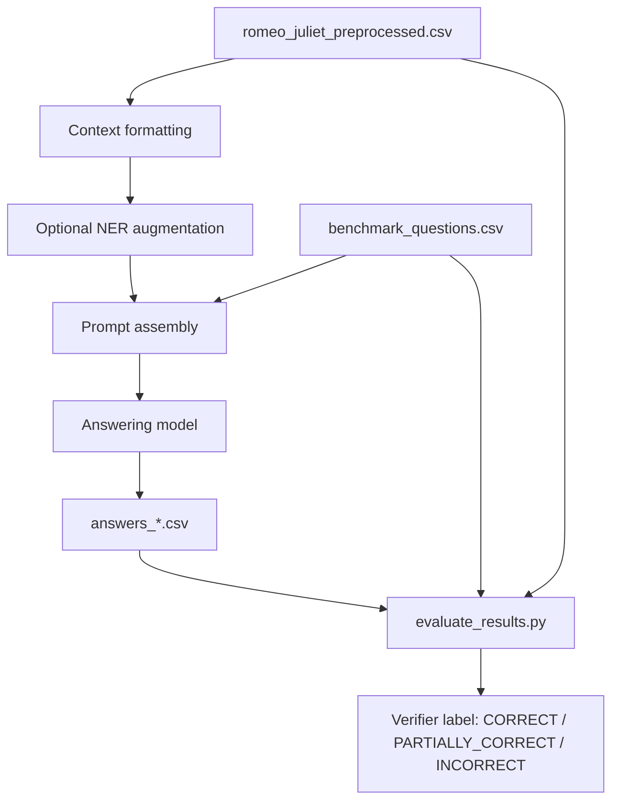
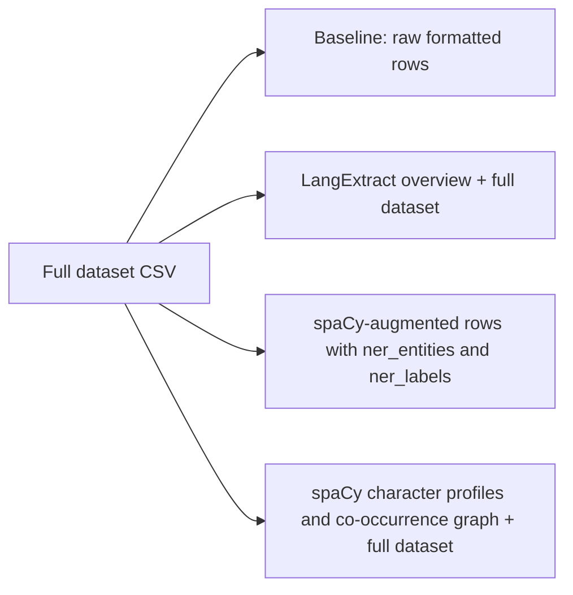

# HW3 Report: entity-augmented long-context question answering on *Romeo and Juliet*

## Abstract

This report examines whether named-entity-aware preprocessing improves question answering over a literary long-context dataset derived from Shakespeare's *Romeo and Juliet*. The benchmark uses a preprocessed 1,068-row CSV version of the play and a 60-question forensics-style evaluation set with gold answers and row-level evidence mappings. For each run, the answering model receives the full dataset, produces an answer, and is then scored by a verifier model that also sees the gold answer, analyst observations, and reconstructed evidence rows. Four context conditions are compared: a raw no-NER baseline, a `langextract` summary prepended to the full dataset, a spaCy-augmented CSV with row-level entity columns, and a spaCy-derived character relationship graph prepended to the full dataset.

The main result is fairly specific. Extra structure helps when it is compact and easy to use, and it hurts when it bloats the prompt without giving the model much guidance. Across the successful runs, `langextract` is the strongest method. Excluding the failed `llama-1b` NER runs, it raises mean strict accuracy from 30.6% to 36.7% and mean lenient accuracy from 65.6% to 68.1%. The `spacy_graph` condition is lighter and sometimes useful, but overall it stays close to the raw baseline. The plain spaCy row-augmentation strategy performs worst on average: it makes the prompt much larger, adds noisy local annotations, and usually lowers accuracy. The evidence in this repository therefore points to a narrower claim than "NER helps." A well-shaped summary helps. More tags do not, at least not in this benchmark.

## 1. Introduction

Long-context question answering over literary text is hard for small and mid-sized language models for reasons that are easy to state and difficult to solve. The model has to keep a large prompt in working memory, decide which parts matter for a particular question, connect events that may be separated by many lines, and reconstruct character relations without drifting into unsupported guesses. Shakespeare adds another layer of difficulty. Names appear in several forms, stage directions carry real narrative state, and the language itself is far enough from modern prose to confuse standard named-entity tools.

This homework asks whether explicit entity-aware preprocessing can make that problem easier. The underlying intuition is sensible: if the model sees a structured overview of characters, events, or relationships before it reads the full dataset, it may have an easier time navigating the play and finding the right evidence when asked a question. That idea is especially appealing for questions about identity, kinship, motive, or multi-step causality. But preprocessing carries costs too. A poor representation can waste context budget, repeat unhelpful information, and leave the model with more text to parse and no better map of the underlying story.

The repository already contains the benchmark code, the saved answer files, and the evaluated outputs. This report uses those artifacts directly. The aim here is not only to list scores, but to explain what each method is doing, how the benchmark actually operates, and why some augmentations help while others do not.

## 2. Materials and experimental setting

The source corpus is `hw3/data/romeo_juliet_preprocessed.csv`. This file contains 1,068 rows derived from the dialogue of *Romeo and Juliet* after preprocessing and merging consecutive lines by the same speaker within a scene. In the no-NER condition, the answering model receives the whole file rendered as text in the format `line_number | act | scene | character | dialogue`. The system does not first retrieve a compact set of relevant rows for each question. It sends the full play every time.

The question set is stored in `hw3/data/benchmark_questions.csv`. It contains 60 forensics-style questions, each paired with a gold answer, analyst observations, and a `csv_row_indices` field that points to the relevant evidence rows in the source dataset. The difficulty labels are 11 easy, 31 medium, and 18 hard questions. Those row indices matter later, because they let the evaluation pipeline reconstruct the relevant evidence after generation.

The evaluated answer models in `hw3/results/` are `gemma-3-4b`, `llama-1b`, `llama-3b`, `ministral-3b`, `mistral-small-3.2`, `phi-4-mini`, and `qwen3-30b-a3b`. Each model has its own result directory, and each context condition is saved as a separate CSV. In this repository, the no-NER condition is recorded as `answers_before_ner.csv`. Scoring is handled separately by `hw3/evaluate_results.py`, which uses the verifier model configured in `hw3/bench/config.py`, namely `openai/gpt-5.4-mini`.

The prompt design also matters here. The answering model receives a fixed system prompt that tells it to behave like an investigator and answer only from the supplied context. The question prompt then repeats the constraints: use only the dataset, avoid outside knowledge, do not include direct quotes or line references, and do not stop mid-sentence. That repeated instruction became important after earlier runs exposed a visible truncation pattern, discussed in Section 5.

## 3. Benchmark pipeline

The pipeline is simple in outline. For each model and each context condition, the code builds a long prompt from the dataset, adds a question-specific instruction block, sends the request through OpenRouter, saves the answer together with token and latency statistics, and then runs a separate evaluation pass. The important detail is that, within a given condition, the dataset side of the prompt is the same for all 60 questions. What changes from one condition to another is the form of the preprocessing.



The execution logic lives in `hw3/run_benchmark.py` and `hw3/bench/runner.py`. The runner loads all questions, formats the dataset, applies the method-specific augmentation if requested, and then iterates through the benchmark rows. For each question it stores the question number, difficulty label, question text, gold answer, observations, evidence indices, model answer, token counts, estimated cost, and latency. Those saved CSVs are the main record of the experiments.

The evaluation step in `hw3/evaluate_results.py` is stronger than plain string matching. Instead of checking whether a model answer happens to share wording with the gold answer, it reconstructs evidence from the source CSV using `csv_row_indices`, then passes the question, the gold answer, the analyst observations, the evidence text, and the model answer to the verifier model. The verifier must return exactly one of three labels: `CORRECT`, `PARTIALLY_CORRECT`, or `INCORRECT`. Throughout this report, "strict" accuracy means the proportion of answers labeled `CORRECT`, while "lenient" accuracy counts both `CORRECT` and `PARTIALLY_CORRECT`.

That distinction is worth keeping in mind when reading the results. This benchmark is not measuring surface overlap. It is asking whether the answer preserves the essential facts supported by the annotated evidence. That makes the evaluation more useful, even if it still relies on an LLM judge rather than a deterministic rubric.

## 4. Context conditions and NER implementations

All four conditions use the same question loop and the same evaluator. What changes is the way the dataset is presented to the answering model.



### 4.1 No-NER baseline

The baseline is deliberately plain. It uses `format_full_dataset()` from `hw3/bench/data_loader.py` to render each row of the play as a line in a large text table. There is no entity summary, no relationship map, and no retrieval stage. This condition matters because it isolates what the model can do with only the processed dialogue and metadata in front of it. It is also the shortest successful prompt format in the repository, averaging about 48,124 prompt tokens across the successful non-`llama-1b` runs.

Even so, the baseline is not an easy setting. Because every question is asked against the full play, the model has to search the narrative on its own. The benefit is that the prompt is clean. It does not ask the model to interpret another layer of preprocessing, and it does not spend extra context window on auxiliary annotations. That trade-off helps explain why the raw baseline stays competitive for several models.

### 4.2 `langextract`: a global semantic overview

The `langextract` method is implemented in `hw3/bench/ner_pipeline.py`. It is the most ambitious method in the repository and, in practice, the one that works best. The pipeline takes the fully formatted dataset text and runs `langextract` with `google/gemini-2.5-flash` as the extraction backend. The extraction prompt asks for seven kinds of information: characters, relationships, emotions, events, locations, objects, and themes. The extracted items are filtered to keep only grounded spans that appear in the source text, cached in `results/_ner_cache/extraction.json`, and then reorganized into a markdown overview.

That overview is not a row-by-row annotation. It is a global summary with sections such as Characters, Relationships, Key Events, Emotional Themes, Locations, Significant Objects, and Themes. The benchmark prepends it above the full dataset and explicitly frames it as a navigation guide.

This method has two clear advantages. First, it adds abstraction without hiding the evidence; the model still receives the full dataset below the summary. Second, it packages information in a form that resembles the benchmark itself. Many of the questions are about who did what, who knew what, who was related to whom, or which event led to another. A short global map of characters and events is more useful for that kind of reasoning than a long trail of local labels.

The cached extraction file makes that easy to see. Alongside names such as `Sampson` and `Gregory`, it includes entries like `star-cross'd lovers`, `ancient grudge break to new mutiny`, and `Enter SAMPSON and GREGORY`. In other words, the method is not just tagging names. It is surfacing narrative anchors that can help a model orient itself before it enters the full prompt.

### 4.3 `spacy`: row-level entity augmentation

The second strategy comes from `hw3/ner_spacy.py` together with the `spacy` branch in `hw3/bench/runner.py`. This method loads `en_core_web_lg`, processes each dialogue row independently, extracts local named entities from the dialogue text, and writes two new columns to `hw3/data/thea_ner_augmented.csv`: `ner_entities` and `ner_labels`. When the benchmark runs in `spacy` mode, the full dataset is reformatted into a wider table that includes `participants`, `normalized_name`, `ner_entities`, and `ner_labels` for every row.

This is a very different representation from `langextract`. It does not try to summarize the play at a global level. Instead, it expands the local representation of every row. In principle that could help, because the answering model sees entity labels right next to the dialogue. In practice, the cost is steep. The prompt becomes much larger, and a lot of the new material is not especially useful.

The saved augmented CSV shows the issue clearly. On the Chorus row, spaCy extracts values such as `Two | Verona | two | the two hours` with labels `CARDINAL | GPE | CARDINAL | TIME`. Those tags are not absurd in isolation, but they do little for the actual QA task. More importantly, the same pattern repeats across the whole play. The method spends a large amount of context budget on local annotations that are often shallow, noisy, or redundant with information already visible in the dialogue.

### 4.4 `spacy_graph`: character profiles and co-occurrence structure

The third preprocessing strategy, implemented in `hw3/bench/spacy_graph.py`, takes a different route. Instead of expanding every row, it runs spaCy NER over the `dialogue` column using `en_core_web_sm`, collects detected person-like entities, and builds two derived structures: per-entity mention profiles and pairwise co-occurrence counts. The output is then formatted as a compact overview with character profiles and "key relationships" ranked by how often entities co-occur.

As an idea, this is closer to the core hypothesis of the homework than the row-level spaCy augmentation. If the real burden is keeping track of social relations across a long narrative, then a short character-and-relationship map makes sense. The model gets a brief orientation at the top of the prompt and then reads the full dataset underneath it.

The problem is not the shape of the representation so much as the quality of the extractor. The cached graph file shows that Shakespearean language creates a lot of noise for a modern general-purpose NER model. Alongside useful entries like `Benvolio`, `Romeo`, and `Juliet`, the graph also includes low-value entities such as `ho`, `Thou`, and `Cast`. Those mistakes weaken the relationship map, because false entities consume space and create misleading edges. Even so, this method is lighter than the row-augmentation strategy and usually performs better, which suggests the general direction is sound even if the current extraction is not clean enough.

## 5. Prompt engineering revision: the "prompt sandwich" fix

One of the more practical lessons in this repository has to do with answer truncation. Earlier runs showed that some models, especially smaller ones, would stop mid-answer after quoting the play and starting what looked like a citation or parenthetical line reference. The example supplied in the homework discussion is hard to miss: the model repeats a quote, drifts into a broken citation pattern, and then cuts off.

That failure mode led to a prompt revision. The system prompt already told the model to answer only from the supplied context. The question prompt was then rewritten to restate the most important generation constraints right before the question: do not use outside knowledge, do not include direct quotes or line references, paraphrase instead, and do not stop mid-sentence. Because those instructions now appear on both sides of the large dataset block, the setup is reasonably described as a prompt sandwich.

The reported change was meaningful. Before the revision, 27 of 60 answers in the affected 3B setup ended mid-thought. After the revision, 16 of 60 did. That is a 41% reduction in truncations. Average answer length also rose from 73 to 116 tokens, a 59% increase. The fix did not eliminate the issue entirely, and the reason is plausible enough: a 3B model trying to hold roughly 43,000 tokens of context in mind may simply lose track of a formatting instruction as it generates. Still, the prompt change removed a visible and avoidable source of failure, so it belongs in the final account of the experiments.

## 6. Results

### 6.1 Per-model comparison

Table 1 reports the main benchmark results. Each cell is written as `strict / lenient`, where strict accuracy counts only answers labeled `CORRECT`, and lenient accuracy counts answers labeled either `CORRECT` or `PARTIALLY_CORRECT`.

| model | baseline | langextract | spacy | spacy_graph |
| --- | --- | --- | --- | --- |
| gemma-3-4b | 11.7 / 43.3 | 13.3 / 45.0 | 6.7 / 36.7 | 10.0 / 46.7 |
| llama-1b | 0.0 / 3.3 | 0.0 / 0.0 | 0.0 / 0.0 | - |
| llama-3b | 13.3 / 53.3 | 16.7 / 50.0 | 13.3 / 38.3 | 13.3 / 48.3 |
| ministral-3b | 13.3 / 65.0 | 25.0 / 71.7 | 18.3 / 63.3 | 16.7 / 58.3 |
| mistral-small-3.2 | 56.7 / 85.0 | 66.7 / 86.7 | 40.0 / 75.0 | 61.7 / 86.7 |
| phi-4-mini | 18.3 / 56.7 | 26.7 / 63.3 | 16.7 / 41.7 | 18.3 / 53.3 |
| qwen3-30b-a3b | 70.0 / 90.0 | 71.7 / 91.7 | 63.3 / 91.7 | 68.3 / 91.7 |

The clearest pattern in Table 1 is that `langextract` improves strict accuracy for every successful non-`llama-1b` model. The gain is small for `gemma-3-4b`, which rises from 11.7% to 13.3%, but much larger for `ministral-3b`, which goes from 13.3% to 25.0%. `Mistral-small-3.2` also benefits clearly, improving from 56.7% to 66.7% strict accuracy. Even `qwen3-30b-a3b`, which is already strong in the baseline condition, edges upward under `langextract` to 71.7% strict and 91.7% lenient accuracy.

The row-level spaCy augmentation shows the opposite tendency. It hurts `gemma-3-4b`, `llama-3b`, `mistral-small-3.2`, `phi-4-mini`, and `qwen3-30b-a3b` in strict accuracy, while only modestly helping `ministral-3b`. In some cases the lenient score stays respectable, but the strict score falls. That looks less like better reasoning and more like a prompt that sometimes nudges the model toward partially relevant answers without improving precision enough to make the trade worthwhile.

The `spacy_graph` condition sits between those extremes. It does better than row-level spaCy in most cases and sometimes matches or slightly exceeds the baseline lenient result, as with `gemma-3-4b`, `mistral-small-3.2`, and `qwen3-30b-a3b`. Still, it does not show the same steady advantage as `langextract`.

### 6.2 Average effect of each method

Because the `llama-1b` NER runs failed at the context-window level rather than the reasoning level, it makes more sense to compare method averages with those runs excluded. Table 2 summarizes mean strict accuracy, mean lenient accuracy, and mean prompt length in tokens under that convention.

| method | mean strict | mean lenient | mean prompt tokens |
| --- | --- | --- | --- |
| baseline | 30.6 | 65.6 | 48,124 |
| langextract | 36.7 | 68.1 | 63,308 |
| spacy | 26.4 | 57.8 | 77,815 |
| spacy_graph | 31.4 | 64.2 | 53,835 |

These aggregates make the central conclusion harder to wave away. `Langextract` is not winning because of one or two unusually good runs. It is the best method on average by both strict and lenient criteria. It does cost extra prompt space, pushing the average from about 48K to about 63K tokens, but the trade is positive for the models that can actually accept the prompt.

The row-level spaCy condition is revealing for the opposite reason. It has the longest prompts by a wide margin, nearly 77.8K tokens on average, and it also has the weakest mean accuracy. That combination is difficult to defend. If a method costs more context and performs worse, the burden of proof shifts heavily against it.

The `spacy_graph` condition is more mixed. It is only modestly larger than the baseline and nudges mean strict accuracy upward from 30.6% to 31.4%, but its mean lenient score slips slightly from 65.6% to 64.2%. That profile looks like a method with a sensible idea behind it, but not yet clean enough to pay off consistently.

### 6.3 Difficulty breakdown

Table 3 reports average accuracy by difficulty level, again excluding the failed `llama-1b` NER runs.

| method | difficulty | mean strict | mean lenient |
| --- | --- | --- | --- |
| baseline | easy | 39.4 | 68.2 |
| baseline | medium | 29.6 | 64.5 |
| baseline | hard | 26.9 | 65.7 |
| langextract | easy | 45.5 | 72.7 |
| langextract | medium | 33.9 | 64.0 |
| langextract | hard | 36.1 | 72.2 |
| spacy | easy | 24.2 | 51.5 |
| spacy | medium | 26.3 | 56.5 |
| spacy | hard | 27.8 | 63.9 |
| spacy_graph | easy | 39.4 | 59.1 |
| spacy_graph | medium | 27.4 | 65.1 |
| spacy_graph | hard | 33.3 | 65.7 |

The hardest questions are where `langextract` looks most useful. Hard questions rise from 26.9% strict accuracy in the baseline to 36.1% under `langextract`, while lenient accuracy increases from 65.7% to 72.2%. That is exactly where a strong global summary ought to help. Hard questions in this benchmark often depend on stitching together separated facts, resolving kinship or motive, or reconstructing multi-step causal chains. A compact overview of the story is a better fit for that work than a local token-level tagger.

The easy-question results are also revealing. `Langextract` raises easy-question strict accuracy from 39.4% to 45.5%, while plain spaCy drops it to 24.2%. That makes it hard to argue that row-level augmentation is only failing on the subtle cases. It seems to be distracting the model even when the question is relatively direct.

## 7. Discussion

The results support the homework's basic intuition, but only in a qualified form. Entity-aware preprocessing can help long-context literary QA, yet the benefit does not come from "more NER" in the abstract. It comes from giving the model a compact, global representation that reduces search burden without smothering the prompt.

That is why `langextract` works best. It changes the shape of the problem instead of merely appending more annotations. The model first sees an organized overview of characters, relationships, events, locations, and themes, then reads the original dataset below it. The summary acts like a scaffold. It is not hard to see why that matters for this benchmark, where so many questions ask who knew what, why a decision was made, which house a character belongs to, or how one scene sets up another.

The plain spaCy augmentation does the opposite. It increases information density without improving information hierarchy. The model gets more tokens, but not a clearer path through them. Because the new columns appear in every row, the prompt becomes repetitively wide and noisy. Many of the annotations are technically plausible and still not useful. The method ends up spending context budget on a representation that is too local and too literal.

`Spacy_graph` is more interesting than its final averages suggest. The representation itself makes sense: if the model struggles to track the social fabric of the play, then a short profile-and-relationship map is a reasonable abstraction. The weak point is the extractor. Shakespeare's diction trips up the general-purpose NER model, and the graph inherits that mess. A cleaner extractor, or even a stricter postprocessing pass, might make this approach much more competitive.

It is also worth noting that the gains are not limited to the largest model in the set. `Mistral-small-3.2` and `ministral-3b` both improve substantially under `langextract`, which is encouraging given the homework's motivation. At the same time, the pattern is not perfectly uniform across metrics. `Llama-3b`, for example, improves in strict accuracy with `langextract`, but its best lenient score remains the raw baseline. That nuance matters. A preprocessing method can make answers sharper without making them broader or more forgiving under the verifier.

## 8. Failures and limitations

The clearest failure case is `llama-1b`. Its no-NER baseline already performs badly, reaching only 0.0% strict and 3.3% lenient accuracy. More importantly, the NER-augmented runs do not really execute as QA experiments at all. The saved CSVs for `answers_after_ner_langextract.csv` and `answers_after_ner_spacy.csv` contain API errors for all 60 questions. The recorded message says the endpoint's maximum context length is 60,000 tokens, while the requests land around 60.3K tokens once the long dataset and generation allowance are combined. Put plainly, this model is not just weak. It cannot accommodate the prompt shape once augmentation is added. There is also no saved `answers_after_ner_spacy_graph.csv` file for `llama-1b`, so that condition should be treated as unavailable rather than scored.

That failure exposes a broader limitation of the experimental design. The benchmark always sends the full dataset, no matter what the question asks. As a result, the comparison is testing several things at once: reasoning ability, long-context retention, tolerance for prompt noise, and context-window capacity. It is not testing question-specific retrieval. A method that looks poor here might look better in a retrieval-augmented setup where the model sees only a small evidence slice. The reverse is also possible: a method that looks good here may partly owe its success to prompt compression rather than to better entity recognition in a narrower sense.

The evaluation setup has its own limitation. The verifier sees the gold answer, the analyst observations, and the evidence rows, which makes it much stronger than a bare string-matching metric. That is a real advantage. But the final labels still come from another language model rather than from a deterministic script. Some evaluator variance is therefore unavoidable, even with the tight output format used here.

Finally, none of the extraction methods is domain-adapted. The spaCy outputs make that obvious. Shakespearean capitalization, archaic forms, and stylized speech regularly produce false or low-value entities. The `spacy_graph` cache includes items such as `ho`, `Thou`, and `Cast`, which should not drive a relationship graph. The augmented CSV likewise contains tags that are plausible in isolation and unhelpful in context. These are not really implementation bugs. They are a reminder that a general-purpose NER system is being pushed into a domain it was not tuned for.

## 9. Conclusion

Taken together, the experiments support a simple but fairly constrained conclusion. Prepending structured entity-aware information to a long literary prompt can improve question answering accuracy, but the success of that strategy depends heavily on the way the structure is presented. In this repository, the best method is `langextract`, which produces a compact semantic overview of the play and consistently improves strict accuracy across all successful non-`llama-1b` models. The `spacy_graph` method is a reasonable idea and relatively cheap in prompt terms, but its gains are limited by noisy extraction. The plain spaCy row-augmentation strategy is the weakest of the three because it expands the prompt aggressively without giving the model a comparably useful global guide.

There is also a practical lesson here that has nothing to do with literary interpretation and everything to do with systems design. Prompt shape matters. `Llama-1b` does not merely answer poorly; under NER augmentation it exceeds the provider's context limit and fails outright. That is part of the result, not a side note.

If this project were extended, the most promising next step would be to combine the best idea from `langextract` with evidence retrieval. A compact entity-and-event overview followed by a question-specific subset of source rows, rather than the full play every time, would likely preserve the value of global guidance while reducing context pressure and widening model compatibility. As the results stand, the message is pretty clear: good structure helps, noisy structure hurts, and concise summaries help more than dense local tags.

## 10. Reproducibility notes

The main scripts involved in the benchmark are `hw3/run_benchmark.py`, `hw3/evaluate_results.py`, `hw3/bench/runner.py`, `hw3/bench/ner_pipeline.py`, `hw3/bench/spacy_graph.py`, and `hw3/ner_spacy.py`. This humanized report was written from those scripts and from the saved result CSVs already present in `hw3/results/`.

Example commands for rerunning a condition are shown below:

```bash
python3 hw3/run_benchmark.py --model mistral-small-3.2 --method baseline
python3 hw3/run_benchmark.py --model mistral-small-3.2 --method langextract
python3 hw3/run_benchmark.py --model mistral-small-3.2 --method spacy
python3 hw3/run_benchmark.py --model mistral-small-3.2 --method spacy_graph
python3 hw3/evaluate_results.py --results-file hw3/results/mistral-small-3.2/answers_before_ner.csv
```

For reproducibility, this report should be read alongside the evaluated answer files under `hw3/results/` and the cached preprocessing outputs under `hw3/results/_ner_cache/`.
